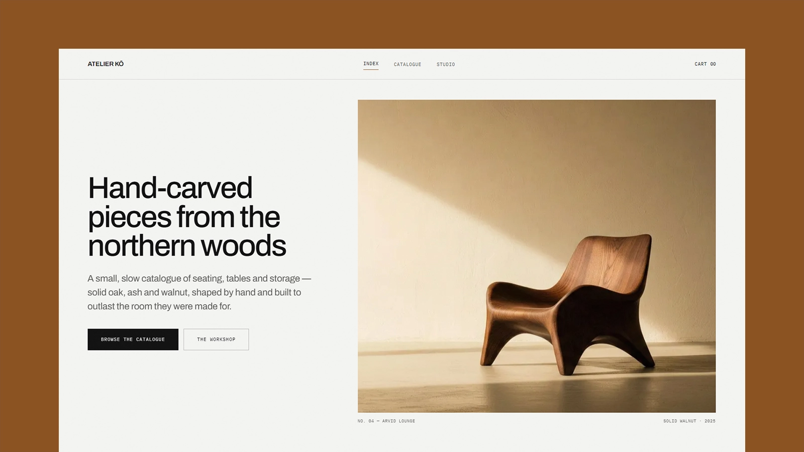

# Lamfy — Astro Photography & Videography Portfolio

[](https://lamfy.example.com/)

[](https://astro.build/)
[](https://tailwindcss.com/)
[](https://www.typescriptlang.org/)
[](./LICENSE)

**Live preview:** https://lamfy.example.com/

A fast, accessible Astro portfolio theme for a photographer and videographer, where the work speaks for itself. Gallery-grey surfaces, one grotesk cut large and tracked tight, technical mono for metadata, and a single accent colour throughout. Content is Markdown validated by Astro content collections, and the site name, navigation, footer, contact details and featured work all come from one config file. The output is fully static — no framework runtime, and every enhancement degrades to working HTML.

## Features

- Editorial homepage: a split hero, a stats band, a "recent projects" grid, a full-width feature project with its own detail table, and a three-service panel
- Portfolio page with client-side discipline and category filters, sorting by year, a live result count, and an empty state when a combination matches nothing
- Static project pages with a thumbnail-switched gallery, a mono detail table (client, role, equipment, year), related projects, and CreativeWork plus BreadcrumbList JSON-LD
- Contact page with direct email and Instagram links — no fake forms or backend required
- About page with a full-bleed photograph, "how I work" principles, a pull-quote, a services section and a statistics band
- Scroll motion built on one IntersectionObserver and four reveal variants — rise, fade, image unmask, and self-drawing rule — each element unobserved after it fires
- Scroll-driven CSS for the settling header and hero parallax, with no JavaScript at all where the browser supports `animation-timeline`, and a styled fallback where it does not
- Central theme config for name, tagline, navigation, footer columns, contact email, social links, and which projects are promoted
- Self-hosted variable Archivo and IBM Plex Mono, latin and latin-ext only, four WOFF2 files totalling about 93 KB and nothing requested from a third-party origin
- Design tokens for every surface, text, accent and hairline colour, plus a small set of component classes for buttons, links, chips, fields and captions
- Astro image pipeline throughout: WebP, explicit dimensions, eager above the fold and lazy below
- Canonical URLs, Open Graph and Twitter cards with image dimensions, a configurable fallback share card, Person, CreativeWork and BreadcrumbList JSON-LD, sitemap generation, and a dynamic `robots.txt`
- Accessible skip link, landmarks, one `h1` per page, real labels on every control, a focus-trapped mobile menu that restores focus on close, and visible focus rings
- Reduced motion and no-JavaScript both render every page complete and static
- Strict TypeScript, typed component props, and a Zod-validated content schema

## Tech Stack

- Astro 7
- Tailwind CSS 4 via the Vite plugin
- Vite 8
- TypeScript (strict)
- Astro content collections
- `@astrojs/sitemap`
- Sharp for image processing

## Requirements

- Node.js `22.12.0` or newer
- npm

## Getting Started

```bash
npm install
npm run dev
```

Build for production:

```bash
npm run build
```

Preview the production build locally:

```bash
npm run preview
```

## Deployment

The build is a plain static `dist/` directory, so any static host will serve it.

Set the canonical domain before building for production. Canonical URLs, Open Graph image URLs, the sitemap, `robots.txt`, and JSON-LD are all derived from it:

```bash
SITE=https://your-domain.com npm run build
```

The value is read by `site` in [astro.config.mjs](./astro.config.mjs), which falls back to a placeholder domain.

## Customization

Start with [src/config/site.ts](./src/config/site.ts) — name, tagline, default metadata, contact email, social links, navigation, footer columns, and the promoted projects all live there.

See [CUSTOMIZATION.md](./CUSTOMIZATION.md) for the full guide: theme tokens and colour, typography, the component classes, motion and reveal variants, project frontmatter, portfolio filters, images, fonts, pages, and SEO.

## Content

Projects live in [src/content/projects](./src/content/projects), one Markdown file per project. The filename becomes the URL slug, so `wedding-film-highlights.md` is served at `/portfolio/wedding-film-highlights`. Frontmatter is validated by the schema in [src/content.config.ts](./src/content.config.ts), and disciplines and categories are derived from the files themselves rather than maintained in a second list.

Project images belong in [src/assets](./src/assets) so Astro can optimize them. Use `public/` only for files that must be served byte-for-byte.

**The current projects, photos and copy are placeholders.** Replace them with real work, photography, and bio copy before publishing — see [Content](#content) above and `src/config/site.ts` for where everything lives.

## Pages

| Route               | Page                                        |
| ------------------- | -------------------------------------------- |
| `/`                 | Homepage                                    |
| `/portfolio`        | Full portfolio with filters and sorting     |
| `/portfolio/[slug]` | Project detail, generated per Markdown file |
| `/about`            | Bio, process, and services                  |
| `/contact`          | Direct contact links (`email`, Instagram)   |
| `/404`              | Not found (`noindex`)                       |

## Typography

The theme self-hosts two families and nothing else: [Archivo](https://fonts.google.com/specimen/Archivo) as a variable font covering every weight it uses, and [IBM Plex Mono](https://fonts.google.com/specimen/IBM+Plex+Mono) at 400 for labels and metadata. Both are split into latin and latin-ext subsets, four WOFF2 files in total, and the latin Archivo file is preloaded because it paints the hero. See [Fonts](./CUSTOMIZATION.md#fonts) to swap or remove them.

## License

MIT. See [LICENSE](./LICENSE) for complete terms.
